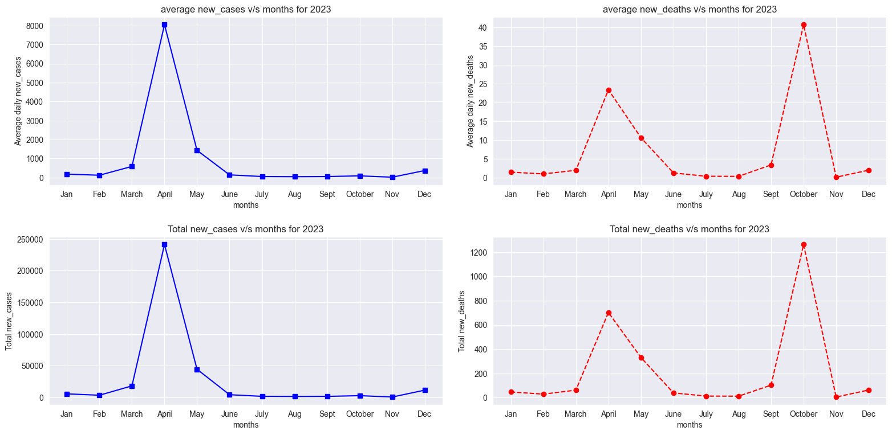

# Covid Data Analysis for India

## Overview
This project analyzes COVID-19 data for India using Python. It leverages powerful data analysis and visualization libraries to extract meaningful insights from the dataset.

## Dataset
- **Source:** [COVID-19 Data](https://covid-19.nyc3.digitaloceanspaces.com/public/owid-covid-data.csv)
- **Description:** The dataset contains global COVID-19 statistics, including case numbers, deaths, vaccinations, and testing data.
- **Format:** CSV file with multiple columns detailing pandemic trends worldwide.

## Libraries Used
The following Python libraries are used for data analysis and visualization:

- **NumPy**: For numerical operations and handling arrays efficiently.
- **Pandas**: For data manipulation, cleaning, and analysis.
- **Matplotlib**: For creating static, animated, and interactive visualizations.
- **Seaborn**: For advanced statistical data visualization with beautiful and informative graphics.

## Features of the Project
- Data Cleaning and Preprocessing
- Exploratory Data Analysis (EDA)
- Time Series Analysis of COVID-19 Cases in India
- Visualization of Trends in Cases, Deaths, and Recoveries
- Insights from Vaccination and Testing Data

## How to Run the Project
1. Clone the repository:
   ```bash
   git clone https://github.com/SayandipSaha666/Covid-Data-Analysis-for-India.git
   ```
2. Navigate to the project directory:
   ```bash
   cd Covid-Data-Analysis-for-India
   ```
3. Install required dependencies:
   ```bash
   pip install numpy pandas matplotlib seaborn
   ```
4. Run the analysis script:
   ```bash
   python analysis.py
   ```

## Results
The analysis produces various plots and statistical insights regarding the COVID-19 situation in India. Visualizations include:
- Daily and cumulative case trends
- Death rate analysis
- Impact of vaccination efforts
- Comparative analysis with other countries

## Yearly comparison of new cases and new deaths


## Analyzed data on yearly basis

- Year 2020 Data
  

  
- Year 2021 Data
  

  
- Year 2022 Data
  

  
- Year 2023 Data
  

  
- Year 2024 Data


## Contributions
Contributions are welcome! Feel free to fork the repository, improve the analysis, and submit a pull request.

## License
This project is open-source and available under the [MIT License](LICENSE).

